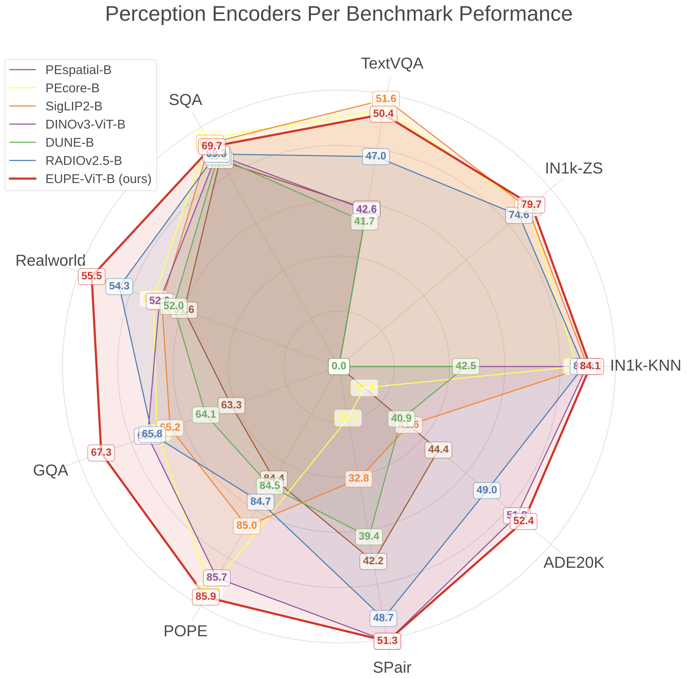

# Efficient Universal Perception Encoder (EUPE)

**[Meta AI](https://ai.meta.com)**

Chenchen Zhu, Saksham Suri, Cijo Jose, Maxime Oquab, Marc Szafraniec, Wei Wen, Yunyang Xiong, Patrick Labatut, Piotr Bojanowski, Raghuraman Krishnamoorthi, Vikas Chandra

[ :scroll: [`Paper`](https://arxiv.org/abs/2603.22387)] [ 🤗 [`HF`](https://huggingface.co/collections/facebook/eupe/)] [ :book: [`BibTeX`](#citing-eupe)]

Reference PyTorch implementation and models for EUPE. For details, see the **[EUPE](https://arxiv.org/abs/2603.22387)** paper.

## Overview

<div align="center">
  

  <i></em><br/>Applying our distillation recipe (EUPE) to ViT-B gives a well-balanced universal encoder that excels at
diverse task domains compared to both ViT-B domain experts and existing agglomerative ViT-Bs.</i>
</div>

<br/>

An extended family of versatile efficient vision encoders producing high-quality features and achieving outstanding performance on various vision tasks including image understanding, dense prediction and vision-language modeling.

## Pretrained models

:information_source: Please follow the link provided below to get access to all the model weights. These URLs can then be used to download the model weights to a local filesystem and point `torch.hub.load()` to these local weights via the `weights` parameters.

See the example code snippets below.

ViT models pretrained on web dataset (LVD-1689M):
<table style="margin: auto">
  <thead>
    <tr>
      <th>Model</th>
      <th>Parameters</th>
      <th>Download</th>
    </tr>
  </thead>
  <tbody>
    <tr>
      <td>ViT-T/16</td>
      <td align="right">6M</td>
      <td align="center"><a href="https://huggingface.co/facebook/EUPE-ViT-T/">[link]</a></td>
    </tr>
    <tr>
      <td>ViT-S/16</td>
      <td align="right">21M</td>
      <td align="center"><a href="https://huggingface.co/facebook/EUPE-ViT-S/">[link]</a></td>
    </tr>
    <tr>
      <td>ViT-B/16</td>
      <td align="right">86M</td>
      <td align="center"><a href="https://huggingface.co/facebook/EUPE-ViT-B/">[link]</a></td>
    </tr>
  </tbody>
</table>

ConvNeXt models pretrained on web dataset (LVD-1689M):
<table style="margin: auto">
  <thead>
    <tr>
      <th>Model</th>
      <th>Parameters</th>
      <th>Download</th>
    </tr>
  </thead>
  <tbody>
    <tr>
      <td>ConvNeXt Tiny</td>
      <td align="right">29M</td>
      <td align="center"><a href="https://huggingface.co/facebook/EUPE-ConvNeXt-T/">[link]</a></td>
    </tr>
    <tr>
      <td>ConvNeXt Small</td>
      <td align="right">50M</td>
      <td align="center"><a href="https://huggingface.co/facebook/EUPE-ConvNeXt-S/">[link]</a></td>
    </tr>
    <tr>
      <td>ConvNeXt Base</td>
      <td align="right">89M</td>
      <td align="center"><a href="https://huggingface.co/facebook/EUPE-ConvNeXt-B/">[link]</a></td>
    </tr>
  </tbody>
</table>

### Pretrained backbones (via PyTorch [Hub](https://docs.pytorch.org/docs/stable/hub.html))

Please follow the instructions [here](https://pytorch.org/get-started/locally/) to install PyTorch (the only required dependency for loading the model). Installing PyTorch with CUDA support is strongly recommended.

```python
import torch

REPO_DIR = <PATH/TO/A/LOCAL/DIRECTORY/WHERE/THE/EUPE/REPO/WAS/CLONED>

# EUPE ViT models pretrained on web images
eupe_vitt16 = torch.hub.load(REPO_DIR, 'eupe_vitt16', source='local', weights=<CHECKPOINT/URL/OR/PATH>)
eupe_vits16 = torch.hub.load(REPO_DIR, 'eupe_vits16', source='local', weights=<CHECKPOINT/URL/OR/PATH>)
eupe_vitb16 = torch.hub.load(REPO_DIR, 'eupe_vitb16', source='local', weights=<CHECKPOINT/URL/OR/PATH>)

# EUPE ConvNeXt models pretrained on web images
eupe_convnext_tiny = torch.hub.load(REPO_DIR, 'eupe_convnext_tiny', source='local', weights=<CHECKPOINT/URL/OR/PATH>)
eupe_convnext_small = torch.hub.load(REPO_DIR, 'eupe_convnext_small', source='local', weights=<CHECKPOINT/URL/OR/PATH>)
eupe_convnext_base = torch.hub.load(REPO_DIR, 'eupe_convnext_base', source='local', weights=<CHECKPOINT/URL/OR/PATH>)
```

### Image transforms

Please use the following transform (standard ImageNet evaluation transform):

```python
import torchvision
from torchvision.transforms import v2

def make_transform(resize_size: int = 256):
    to_tensor = v2.ToImage()
    resize = v2.Resize((resize_size, resize_size), antialias=True)
    to_float = v2.ToDtype(torch.float32, scale=True)
    normalize = v2.Normalize(
        mean=(0.485, 0.456, 0.406),
        std=(0.229, 0.224, 0.225),
    )
    return v2.Compose([to_tensor, resize, to_float, normalize])
```

## Installation

The training and evaluation code requires PyTorch version >= 2.7.1 as well as a few other 3rd party packages. Note that the code has only been tested with the specified versions and also expects a Linux environment. To setup all the required dependencies for training and evaluation, please follow the instructions below:

*[micromamba](https://mamba.readthedocs.io/en/latest/user_guide/micromamba.html)* **(Recommended)** - Clone the repository and then create and activate a `eupe` conda environment using the provided environment definition:

```shell
micromamba env create -f conda.yaml
micromamba activate eupe
```

## Data preparation

### ADE20K

Create a folder to host the [ADE20K dataset](http://sceneparsing.csail.mit.edu) for example:

```
export DATASETS_ROOT=${HOME}/datasets
mkdir -p ${DATASETS_ROOT}/ADE20K
with-proxy wget http://data.csail.mit.edu/places/ADEchallenge/ADEChallengeData2016.zip
unzip ADEChallengeData2016.zip -d ${DATASETS_ROOT}/ADE20K
```
After untarring the data file, the directory structure should be similar to the following,

the training images:

    images/training/ADE_train_00000001.jpg
    images/training/ADE_train_00000002.jpg
        ...
    images/training/ADE_train_00020210.jpg

the corresponding annotation masks for the training images:

    annotations/training/ADE_train_00000001.png
    annotations/training/ADE_train_00000002.png
        ...
    annotations/training/ADE_train_00020210.png

the validation images:

    images/validation/ADE_val_00000001.jpg
    images/validation/ADE_val_00000002.jpg
        ...
    images/validation/ADE_val_00002000.jpg

the corresponding annotation masks for the validation images:

    annotations/validation/ADE_val_00000001.png
    annotations/validation/ADE_val_00000002.png
        ...
    annotations/validation/ADE_val_00002000.png

Note: annotations masks contain labels ranging from 0 to 150, where 0 refers to "other objects". We do not consider those pixels in our evaluation.

objectInfo150.txt contains the information about the labels of the 150 semantic categories, including indices, pixel ratios and names.

### NYUv2 Depth

Create a folder to host the [NYU dataset](https://cs.nyu.edu/~fergus/datasets/nyu_depth_v2.html) for example:

```
export DATASETS_ROOT=${HOME}/datasets
mkdir -p ${DATASETS_ROOT}/NYU
```

We use the NYU subset extracted by [BTS](https://github.com/cleinc/bts/blob/master/tensorflow/README.md) from the 120k samples of the original NYU raw dataset.

#### Option 1 -- Follow BTS's instructions
Please follow BTS instructions to create the dataset:
- [train set](https://github.com/cleinc/bts/blob/master/tensorflow/README.md#nyu-depvh-v2)
- [test set](https://github.com/cleinc/bts/blob/master/README.md#prepare-nyu-depth-v2-test-set).

Make sure you also download the train and test splits:
```
wget https://github.com/cleinc/bts/blob/master/train_test_inputs/nyudepthv2_train_files_with_gt.txt -O ${DEPTH_DATASETS_ROOT}/NYU/nyu_train.txt
wget https://github.com/cleinc/bts/blob/master/train_test_inputs/nyudepthv2_test_files_with_gt.txt -O ${DEPTH_DATASETS_ROOT}/NYU/nyu_test.txt
```

#### Option 2 (preferred) -- Download the readily availble dataset from BinsFormer
Alternatively, one can download the dataset from the following Google Drive [link](https://drive.google.com/file/d/1xI9ksHzCC_kUz6Z4FL_b1ttgj3RVHGwW/view?usp=sharing). If the Google Drive link is not available anymore, try Option 1.

Expected contents:
- `$DEPTH_DATASETS_ROOT/NYU/basement/[...]`
- `$DEPTH_DATASETS_ROOT/NYU/basement_0001a/[...]`
- `$DEPTH_DATASETS_ROOT/NYU/basement_0001b/[...]`
- `$DEPTH_DATASETS_ROOT/NYU/bathroom/[...]`
- `$DEPTH_DATASETS_ROOT/NYU/[...]`
- `$DEPTH_DATASETS_ROOT/NYU/study_room_0004/[...]`
- `$DEPTH_DATASETS_ROOT/NYU/study_room_0005a/[...]`
- `$DEPTH_DATASETS_ROOT/NYU/study_room_0005b/[...]`
- `$DEPTH_DATASETS_ROOT/NYU/nyu_test.txt`
- `$DEPTH_DATASETS_ROOT/NYU/nyu_train.txt`

Note: if data is downloaded with Option 2 make sure to rename `nyu` into `NYU`.

### ImageNet-1k

The root directory of the dataset should hold the following contents:

- `<ROOT>/test/ILSVRC2012_test_00000001.JPEG`
- `<ROOT>/test/[..]`
- `<ROOT>/test/ILSVRC2012_test_00100000.JPEG`
- `<ROOT>/train/n01440764/n01440764_10026.JPEG`
- `<ROOT>/train/[...]`
- `<ROOT>/train/n15075141/n15075141_9993.JPEG`
- `<ROOT>/val/n01440764/ILSVRC2012_val_00000293.JPEG`
- `<ROOT>/val/[...]`
- `<ROOT>/val/n15075141/ILSVRC2012_val_00049174.JPEG`
- `<ROOT>/labels.txt`

The provided dataset implementation expects a few additional metadata files to be present under the extra directory:

- `<EXTRA>/class-ids-TRAIN.npy`
- `<EXTRA>/class-ids-VAL.npy`
- `<EXTRA>/class-names-TRAIN.npy`
- `<EXTRA>/class-names-VAL.npy`
- `<EXTRA>/entries-TEST.npy`
- `<EXTRA>/entries-TRAIN.npy`
- `<EXTRA>/entries-VAL.npy`

These metadata files can be generated (once) with the following lines of Python code:

```python
from eupe.data.datasets import ImageNet

for split in ImageNet.Split:
    dataset = ImageNet(split=split, root="<ROOT>", extra="<EXTRA>")
    dataset.dump_extra()
```

Note that the root and extra directories do not have to be distinct directories.

## Evaluation

In order to evaluate the model, run the following evaluation on a single node:

### Linear segmentation with data augmentation on ADE20K

```shell
PYTHONPATH=. python eupe/eval/segmentation/run.py \
model.eupe_hub=eupe_vitb16 \
model.pretrained_weights=<PATH/TO/CHECKPOINT.pt> \
config=eupe/eval/segmentation/configs/config-ade20k-linear-training.yaml \
datasets.root=<PATH/TO/DATASET> \
output_dir=<PATH/TO/OUTPUT/DIR>
```

After the job completes, you will find in the output path directory you specified
- `segmentation_config.yaml` that contains the config you trained the model with;
- `model_final.pth`, the final linear head checkpoint at the end of training; and
- `results-semantic-segmentation.csv` with the final metrics.

### Linear depth estimation on NYUv2 Depth
```shell
PYTHONPATH=. python eupe/eval/depth/run.py \
    model.eupe_hub=eupe_vitb16 \
    model.pretrained_weights=<PATH/TO/CHECKPOINT.pt> \
    config=eupe/eval/depth/configs/config-nyu.yaml \
    datasets.root=<PATH/TO/DATASET> \
    output_dir=<PATH/TO/OUTPUT/DIR>
```
After the job completes, you will find in the output path directory you specified
- `depth_config.yaml` that contains the config you trained the model with;
- `model_final.pth`, the final linear head checkpoint at the end of training; and
- `results-depth.csv` with the final metrics.

### k-NN classification on ImageNet-1k

```shell
PYTHONPATH=. python -m eupe.run.submit eupe/eval/knn.py \
  model.eupe_hub=eupe_vitb16 \
  model.pretrained_weights=<PATH/TO/CHECKPOINT.pt> \
  output_dir=<PATH/TO/OUTPUT/DIR> \
  train.dataset=ImageNet:split=TRAIN:root=<PATH/TO/DATASET>:extra=<PATH/TO/DATASET> \
  eval.test_dataset=ImageNet:split=VAL:root=<PATH/TO/DATASET>:extra=<PATH/TO/DATASET>
```

## License

EUPE code and model weights are released under the FAIR Research License. See [LICENSE.md](LICENSE.md) for additional details.

## Contributing

See [contributing](CONTRIBUTING.md) and the [code of conduct](CODE_OF_CONDUCT.md).

## Citing EUPE

If you find this repository useful, please consider giving a star :star: and citation:

```
@misc{zhu2026eupe,
  title={Efficient Universal Perception Encoder},
  author={Zhu, Chenchen and Suri, Saksham and Jose, Cijo and Oquab, Maxime and Szafraniec, Marc and Wen, Wei and Xiong, Yunyang and Labatut, Patrick and Bojanowski, Piotr and Krishnamoorthi, Raghuraman and Chandra, Vikas},
  year={2026},
  eprint={2603.22387},
  archivePrefix={arXiv},
  primaryClass={cs.CV},
  url={https://arxiv.org/abs/2603.22387},
}
```
## Acknowledgements
This project makes use of the excellent [DINOv3](https://github.com/facebookresearch/dinov3) library. We are very grateful for their work.
